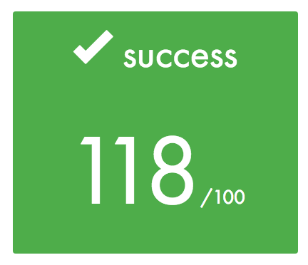

# CoreWar
* [Subject](#subject)
* [Method](#method)
* [Help](#help)
* Final Grade:

# Subject   :pushpin:

The Canadian mathematician [Alexander Keewatin Dewdney](https://en.wikipedia.org/wiki/Alexander_Dewdney) (author of "The Planiverse") first
introduced [Corewar](http://en.wikipedia.org/wiki/Core_War) in a series of Scientific American articles
starting in 1984.

In this game, computer programs  compete in a virtual arena
for digital supremacy. Warriors are written in a simple Assembly dialect inspired
from *Redcode*.
The arena is an enclosed system, once Warriors are loaded into memory at a random location, each one execute one instruction in turn. The goal is to cause the processes of opposing programs to terminate. The winner is the last one to have a surviving process.

It consists of pitting little programs (called *Warriors*) against one another in a virtual arena.
They are written in a simple Assembly dialect inspired from *Redcode*.
The arena is an enclosed system with a circular memory , once Warriors are loaded into memory at a fixed location based from their insertion number or specified with commande line options, each one execute one instruction in turn.
Each program’s objective is to "survive", that is to say executing a special instruction ("live") that means "**I’m still alive**".
These programs simultaneously execute in the virtual machine and in the same memory zone, which enables them to write on one another.
The winner of the game is the last one to have executed the "live" instruction.

## Virtual Machine

### Assembler

Warriors are written a simple language called *assembly code*, higly inspired from *redcode*, with only one instruction per line. In this way, compiled programs (.s extensions) are translated to *Bytecode* (.cor), directly interpreted by the virtual machine. 

#### Instructions

Instructions are composed of 3 elements:
- An instruction code (called *opcode*). The instructions that the machine knows are defined in the op_tab array, which is delcared in op.c.
- Some instructions need a *bytecode* to describes the parameters types (see :arrow_down: for details on these types).
- Instruction *parameters*, from 0 to MAX_ARGS_NUMBER, separated by commas.
- An optional *label*, followed by the LABEL_CHAR character. Labels can be any of the
character strings that are composed of elements from the LABEL_CHARS string.

#### Parameters

Each parameter can be one of three types:
- *Register* : from r1 to rREG_NUMBER.
- *Direct* : The DIRECT_CHAR character, followed by a value or a label. For instance, %4 or %:label
- *Indirect* : A value or a label (preceded by LABEL_CHAR), which represents the value that is found at the parameter’s
address (in relation to PC).
For instance, ld 4,r5 loads the REG_SIZE bytes found at the PC+4 address into r5

### Arena

It is the *arena* where Warriors engage in combat. Obviously, the virtual machine, also known as Memory Array Redcode Simulator (*MARS*), is able to run several processes simultaneously.

#### Warriors
Each warriors contain the following :

- REG_NUMBER *registers* of REG_SIZE bytes each.
A register is a memory zone that contains only one value. In a real machine, it is embedded within the processor,
and can consequently be accessed very quickly. REG_NUMBER and REG_SIZE are defined in op.h.
- A *PC* (Program Counter)
This is a special register that contains the memory address (in the virtual machine) of the next instruction to be
decoded and executed. It is very practical if you want to know where you are and to write things in the memory.

- A flag badly named "*carry*" that is worth one if and only if the last operation returned zero.

*A number* is associated to each player, according to the order given by the arguments.
This number is generated by the virtual machine and is given to the programs, but they can be forced with the **-n option**.
The opposite of this number (-1 for the 1st warrior, and so on) is stored in the r1 register at the system startup (all of the others will be initialized at 0, except, of course, the PC).

#### Virtual machine
The machine’s role is to execute the programs that are given to it as parameters, generating processes. All instruction are executed *at the end* of their sleep time, given by **op.h**.
It must check that each process calls the "live" instruction every CYCLE_TO_DIE cycles. With each execution of the **"live"** instruction, the machine must display **"The player NB_OF_PLAYER(NAME_OF_PLAYER) is alive."**

If, after NBR_LIVE executions of the instruction live, several processes are still alive, CYCLE_TO_DIE is decreased by
CYCLE_DELTA units. This starts over until there are no live processes left.
When a player wins, the machine must display **"The player NB_OF_PLAYER(NAME_OF_PLAYER) has won."**

# Method

The projet is subject to interpretation. To help us an example of an Assembler and the Corewar were given. To be rigorous, our team decided to *mirror the outputs* of the model. Furthermore, it allowed us to generate *unit tests* for the correction. But while we were working, we found *several difference* between the subject and the model we had to reproduce.
The current version of the project is full of comments for better understanding.

### Arena

We build a state machine for the parsing. The virtual machine is a simple array of size MEM_SIZE, where the Warriors data are copied.
Then a loop is running until there is no process left. Each one of them is stored in a circular doubly linked list. At each cycle a routine is applied and a Warrior can execute its instruction when its exec_cycle meets the current cycle. At each *CYCLE_TO_DIE* cycle, a round check is made : every Warrior who did not declared they are alive is killed. Then the next cycle to die is updated if necessary.

## Credits

- *[42 profile](https://profile.intra.42.fr/users/mvillemi) - [Linkedin](https://www.linkedin.com/in/mai-line-villemin-549773a5/) - [Github](https://github.com/LineChan)* - Villemin Mai Line
- *[42 profile](https://profile.intra.42.fr/users/igomez) - [Linkedin](https://www.linkedin.com/in/illan-gomez-821a85b0/) - [Github](https://github.com/Zoellingam)* - Gomez Illan
